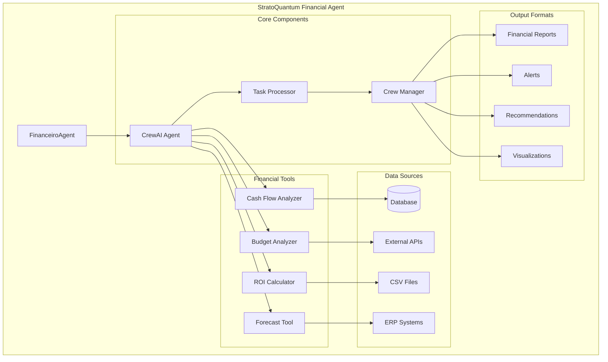
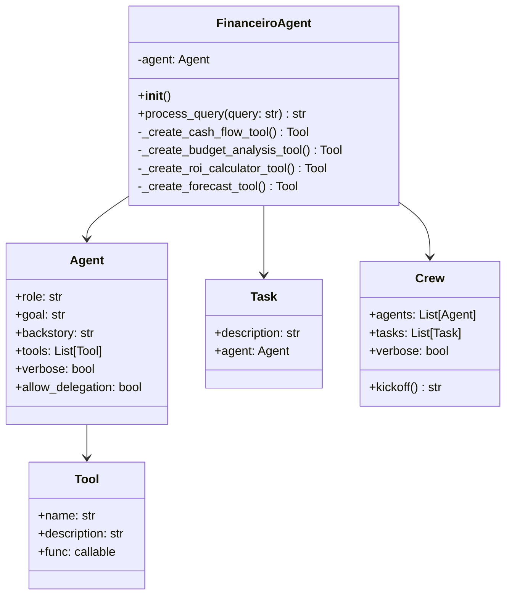
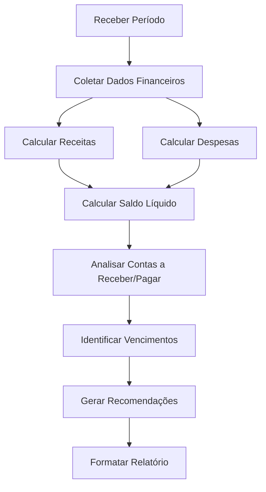
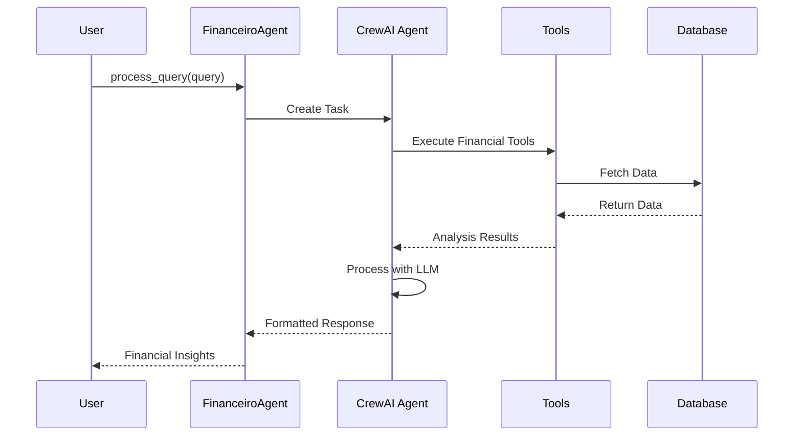

# StratoQuantum - Agente Financeiro: Arquitetura e Documentação

## 📋 Visão Geral

O **Agente Financeiro** é um componente especializado do ecossistema StratoQuantum, desenvolvido com o framework CrewAI para análise financeira avançada, gestão de fluxo de caixa e projeções estratégicas.

## 🎯 Objetivo e Responsabilidades

### Objetivo Principal
Fornecer análises financeiras precisas e insights estratégicos para tomada de decisão empresarial, utilizando dados em tempo real e algoritmos de previsão.

### Responsabilidades Core
- **Análise de Fluxo de Caixa**: Monitoramento de entradas e saídas
- **Gestão Orçamentária**: Controle e análise de orçamentos departamentais
- **Cálculo de ROI**: Avaliação de retorno sobre investimentos
- **Projeções Financeiras**: Previsões baseadas em tendências históricas
- **Alertas e Recomendações**: Insights acionáveis para gestores

## 🏗️ Arquitetura do Sistema



## 🔧 Estrutura de Classes e Métodos

### Classe Principal: `FinanceiroAgent`



## 🛠️ Ferramentas Financeiras Detalhadas

### 1. Cash Flow Analyzer (`cash_flow_analyzer`)

**Propósito**: Análise completa do fluxo de caixa empresarial

**Funcionalidades**:
- Cálculo de receitas vs despesas
- Análise de contas a receber/pagar
- Identificação de vencimentos críticos
- Recomendações de gestão de caixa

**Estrutura de Dados**:
```python
{
    "receitas": float,
    "despesas": float,
    "saldo_liquido": float,
    "contas_receber": float,
    "contas_pagar": float,
    "vencimentos_hoje": int
}
```

**Fluxo de Processamento**:


### 2. Budget Analyzer (`budget_analyzer`)

**Propósito**: Análise orçamentária por departamento

**Funcionalidades**:
- Comparação orçado vs realizado
- Cálculo de variações percentuais
- Identificação de departamentos críticos
- Ranking de performance orçamentária

**Estrutura de Dados**:
```python
{
    "departamento": {
        "orcado": float,
        "gasto": float,
        "variacao": float
    }
}
```

### 3. ROI Calculator (`roi_calculator`)

**Propósito**: Cálculo de retorno sobre investimento

**Funcionalidades**:
- Cálculo de ROI percentual
- ROI mensal médio
- Classificação de investimentos
- Análise de viabilidade

**Fórmula**:
```
ROI = ((Retorno - Investimento) / Investimento) × 100
ROI Mensal = ROI Total / Período em Meses
```

### 4. Forecast Tool (`financial_forecast`)

**Propósito**: Projeções financeiras baseadas em tendências

**Funcionalidades**:
- Projeção de receitas
- Estimativa de custos
- Cálculo de lucros futuros
- Análise de crescimento

**Algoritmo de Projeção**:
```
Receita Projetada = Receita Base × (1 + Taxa de Crescimento)^Período
```

## 🔄 Fluxo de Processamento de Consultas



## 📊 Tipos de Análises Suportadas

### 1. Análises Operacionais
- **Fluxo de Caixa Diário/Mensal**
- **Controle de Vencimentos**
- **Gestão de Inadimplência**
- **Análise de Liquidez**

### 2. Análises Estratégicas
- **Projeções de Crescimento**
- **Análise de Investimentos**
- **Planejamento Orçamentário**
- **Cenários Financeiros**

### 3. Análises de Performance
- **ROI por Projeto**
- **Eficiência Departamental**
- **Margem de Contribuição**
- **Break-even Analysis**

## 🎨 Formato de Saídas

### Relatórios Estruturados
```
📊 ANÁLISE DE FLUXO DE CAIXA (MONTHLY)

💰 Receitas: R$ 127,000.00
💸 Despesas: R$ 89,000.00
📈 Saldo Líquido: R$ 38,000.00

🔄 CONTAS A RECEBER: R$ 45,200.00
🔄 CONTAS A PAGAR: R$ 31,800.00
⚠️  VENCIMENTOS HOJE: 15 contas

📋 RECOMENDAÇÕES:
• Priorizar cobrança das contas em atraso
• Negociar prazos com fornecedores principais
• Manter reserva de emergência de 3 meses
```

### Alertas e Notificações
- 🟢 **Status Normal**: Indicadores dentro dos parâmetros
- 🟡 **Atenção**: Métricas próximas aos limites
- 🔴 **Crítico**: Situações que requerem ação imediata

## 🔧 Configuração e Personalização

### Parâmetros Configuráveis
```python
# Configurações do Agente
AGENT_CONFIG = {
    "role": "Especialista Financeiro",
    "verbose": True,
    "allow_delegation": False,
    "max_iterations": 5,
    "temperature": 0.1  # Para respostas mais precisas
}

# Configurações de Análise
ANALYSIS_CONFIG = {
    "default_period": "monthly",
    "growth_rate": 0.08,
    "cost_ratio": 0.7,
    "emergency_reserve_months": 3
}
```

### Integração com Dados Reais
```python
# Exemplo de integração com banco de dados
def connect_to_database():
    return DatabaseConnection(
        host=os.getenv("DATABASE_HOST"),
        database=os.getenv("DATABASE_NAME"),
        user=os.getenv("DATABASE_USER"),
        password=os.getenv("DATABASE_PASSWORD")
    )

# Exemplo de integração com ERP
def connect_to_erp():
    return ERPConnector(
        api_key=os.getenv("ERP_API_KEY"),
        base_url=os.getenv("ERP_BASE_URL")
    )
```

## 🚀 Casos de Uso Práticos

### 1. Análise de Fluxo de Caixa Mensal
```python
agent = FinanceiroAgent()
response = agent.process_query(
    "Como está nosso fluxo de caixa este mês e quais são as principais recomendações?"
)
```

### 2. Avaliação de Investimento
```python
response = agent.process_query(
    "Calcule o ROI de um investimento de R$ 50.000 com retorno esperado de R$ 75.000 em 12 meses"
)
```

### 3. Projeção Financeira
```python
response = agent.process_query(
    "Gere uma projeção financeira para os próximos 6 meses considerando crescimento de 8% ao mês"
)
```

### 4. Análise Orçamentária
```python
response = agent.process_query(
    "Analise a performance orçamentária do departamento de tecnologia"
)
```

## 🔮 Roadmap de Melhorias

### Versão 2.7.0 (Próxima)
- [ ] Integração com APIs bancárias
- [ ] Machine Learning para previsões
- [ ] Dashboard interativo
- [ ] Alertas automáticos por email/Slack

### Versão 2.8.0 (Futuro)
- [ ] Análise de risco financeiro
- [ ] Compliance e auditoria
- [ ] Integração com blockchain
- [ ] IA para detecção de fraudes

### Versão 3.0.0 (Longo Prazo)
- [ ] Agente autônomo para decisões
- [ ] Integração com mercado financeiro
- [ ] Análise preditiva avançada
- [ ] Multi-moeda e internacionalização

## 🛡️ Segurança e Compliance

### Proteção de Dados
- Criptografia de dados sensíveis
- Logs de auditoria
- Controle de acesso baseado em roles
- Backup automático de dados financeiros

### Compliance Financeiro
- Conformidade com normas contábeis
- Relatórios para auditoria
- Rastreabilidade de transações
- Políticas de retenção de dados

## 📚 Referências e Recursos

### Documentação Técnica
- [CrewAI Documentation](https://docs.crewai.com/)
- [LangChain Tools](https://python.langchain.com/docs/modules/agents/tools/)
- [Financial Analysis Best Practices](https://www.investopedia.com/financial-analysis/)

### Padrões Financeiros
- IFRS (International Financial Reporting Standards)
- GAAP (Generally Accepted Accounting Principles)
- CPC (Comitê de Pronunciamentos Contábeis)

---

**Desenvolvido pela equipe StratoQuantum** | Versão 2.6.8 | Última atualização: Janeiro 2025