# StratoQuantum - Integração do Agente Financeiro

## 🌐 Visão Geral da Integração

O Agente Financeiro opera como parte do ecossistema StratoQuantum, integrando-se com outros agentes e componentes da plataforma para fornecer análises financeiras contextualizadas.

## 🔗 Arquitetura de Integração

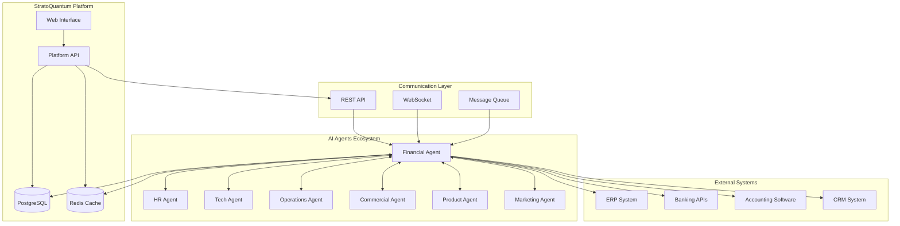

## 🤝 Colaboração Entre Agentes

### Cenários de Colaboração

#### 1. Análise de ROI de Campanhas de Marketing
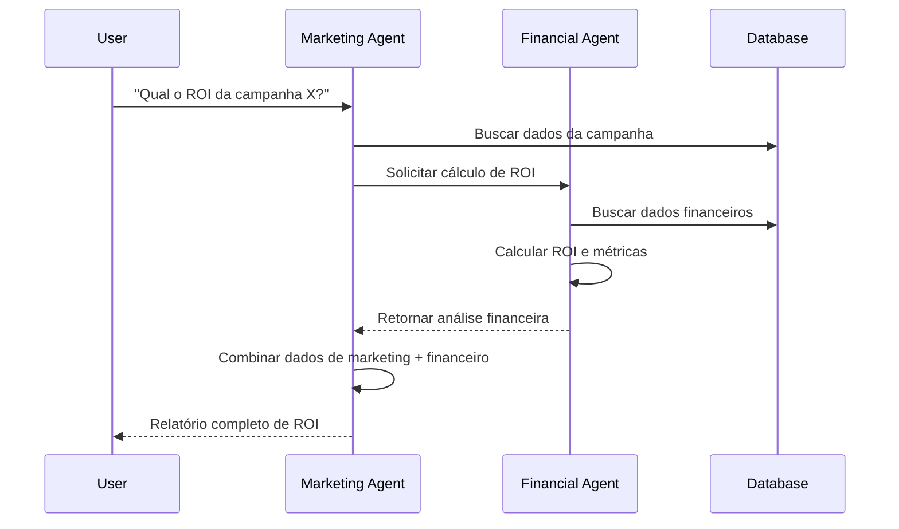

#### 2. Análise de Custos de Contratação (HR + Financeiro)
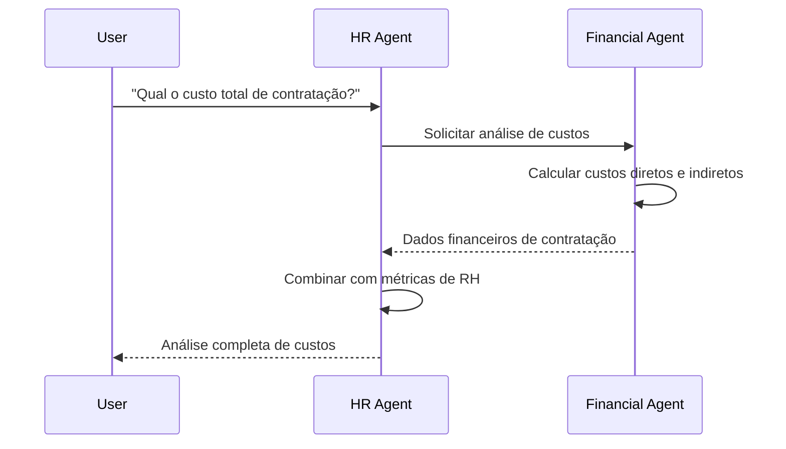

#### 3. Orçamento de Projetos (Product + Tech + Financial)
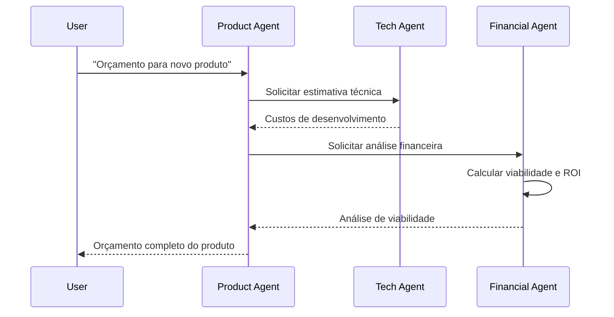

## 📊 Fluxos de Dados Financeiros

### Entrada de Dados
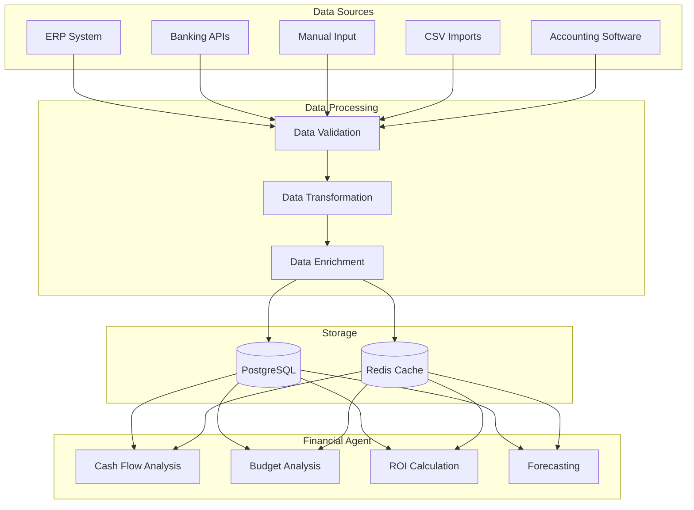

### Saída de Dados
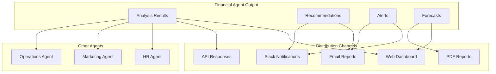

## 🔧 APIs e Endpoints

### Financial Agent API Endpoints

```python
# Análise de Fluxo de Caixa
POST /api/agents/financial/cash-flow
{
    "period": "monthly",
    "department": "all",
    "date_range": {
        "start": "2025-01-01",
        "end": "2025-01-31"
    }
}

# Cálculo de ROI
POST /api/agents/financial/roi
{
    "investment": 50000,
    "return_value": 75000,
    "period_months": 12,
    "project_id": "proj_123"
}

# Análise Orçamentária
POST /api/agents/financial/budget
{
    "department": "technology",
    "period": "quarterly",
    "comparison_type": "budget_vs_actual"
}

# Projeção Financeira
POST /api/agents/financial/forecast
{
    "months": 6,
    "growth_rate": 0.08,
    "scenario": "optimistic"
}
```

### Integração com Outros Agentes

```python
# Exemplo de chamada inter-agentes
class FinanceiroAgent:
    async def collaborate_with_marketing(self, campaign_data):
        """Colabora com agente de marketing para análise de ROI"""
        marketing_agent = await self.get_agent("marketing")
        
        # Solicita dados da campanha
        campaign_metrics = await marketing_agent.get_campaign_metrics(
            campaign_data["campaign_id"]
        )
        
        # Calcula ROI financeiro
        roi_analysis = self.calculate_campaign_roi(
            investment=campaign_data["budget"],
            revenue=campaign_metrics["generated_revenue"],
            costs=campaign_metrics["additional_costs"]
        )
        
        return {
            "financial_analysis": roi_analysis,
            "marketing_metrics": campaign_metrics,
            "recommendations": self.generate_recommendations(roi_analysis)
        }
```

## 🔄 Workflows Integrados

### Workflow 1: Aprovação de Orçamento
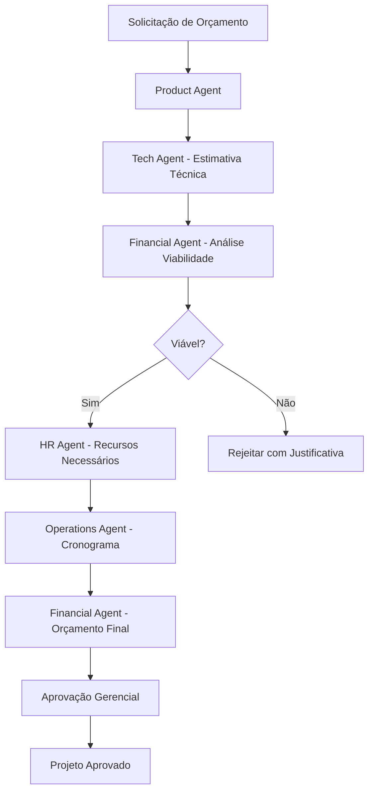

### Workflow 2: Monitoramento Financeiro Contínuo
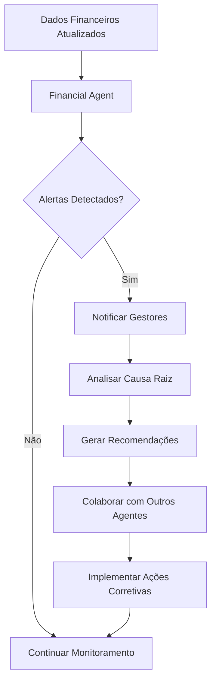

## 📱 Interface de Usuário

### Dashboard Financeiro
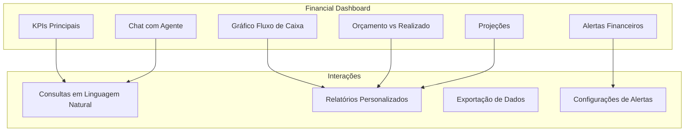

### Exemplos de Interação

```javascript
// Chat com Agente Financeiro
const chatExamples = [
    {
        user: "Como está nosso fluxo de caixa este mês?",
        agent: "📊 Análise de Fluxo de Caixa (Janeiro 2025)...",
        tools_used: ["cash_flow_analyzer"]
    },
    {
        user: "Qual o ROI da campanha de Black Friday?",
        agent: "Vou colaborar com o agente de marketing para obter os dados...",
        tools_used: ["roi_calculator", "marketing_collaboration"]
    },
    {
        user: "Projete nossos resultados para os próximos 6 meses",
        agent: "🔮 Projeção Financeira (6 meses)...",
        tools_used: ["financial_forecast"]
    }
];
```

## 🔐 Segurança e Permissões

### Controle de Acesso
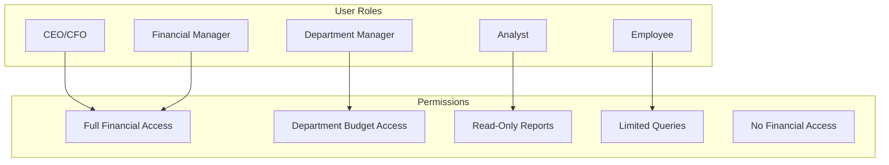

### Auditoria e Logs
```python
# Exemplo de log de auditoria
{
    "timestamp": "2025-01-11T15:30:00Z",
    "user_id": "user_123",
    "agent": "financial",
    "action": "cash_flow_analysis",
    "query": "Análise de fluxo de caixa mensal",
    "tools_used": ["cash_flow_analyzer"],
    "data_accessed": ["revenue", "expenses", "accounts"],
    "result_summary": "Generated monthly cash flow report",
    "ip_address": "192.168.1.100",
    "session_id": "sess_456"
}
```

## 🚀 Deployment e Escalabilidade

### Arquitetura de Deploy
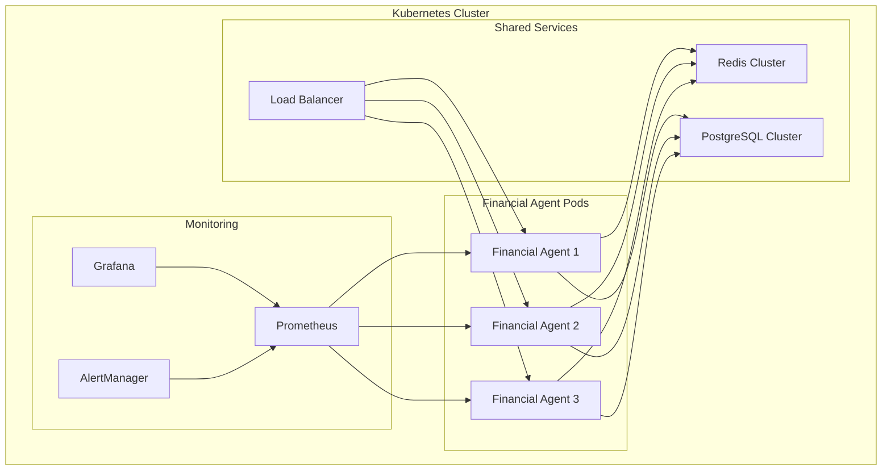

### Métricas de Performance
```yaml
# Exemplo de métricas monitoradas
financial_agent_metrics:
  - query_response_time_seconds
  - queries_per_minute
  - tool_execution_time_seconds
  - cache_hit_ratio
  - database_connection_pool_usage
  - memory_usage_bytes
  - cpu_usage_percent
  - error_rate_percent
```

---

**Esta documentação fornece uma visão completa da integração do Agente Financeiro no ecossistema StratoQuantum, mostrando como ele colabora com outros componentes para fornecer análises financeiras abrangentes e contextualizadas.**